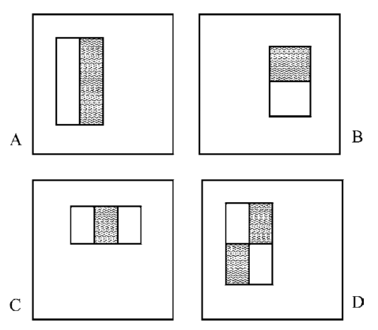
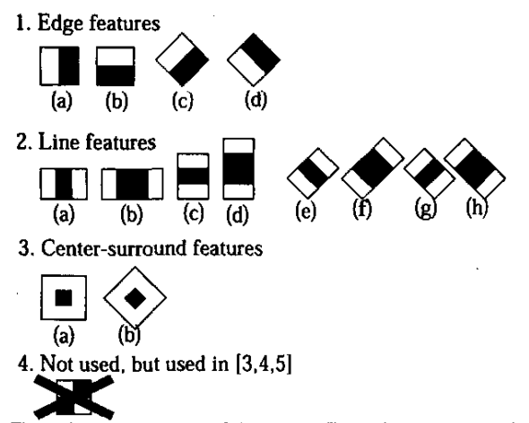

# The implementation of Viola-Jones Algorithm

Participants:
- Bhargav Ram Mandadi <sh27293@umbc.edu>

This project aims to implement Viola-Jones Algorithm [1] and improve the performance.

## Features
Viola, P., & Jones, M. [1] used three different kinds of features in the algorithm:
  

Lienhart, R., & Maydt, J. [2] introduced an extended set of twisted Haar-like feature:

## References

1. Viola, P., & Jones, M. (2001). Rapid object detection using a boosted cascade of simple features. In Computer Vision and Pattern Recognition, 2001. CVPR 2001. Proceedings of the 2001 IEEE Computer Society Conference on (Vol. 1, pp. I-I). IEEE.
2. Lienhart, R., & Maydt, J. (2002). An extended set of haar-like features for rapid object detection. In Image Processing. 2002. Proceedings. 2002 International Conference on (Vol. 1, pp. I-I). IEEE.
 

